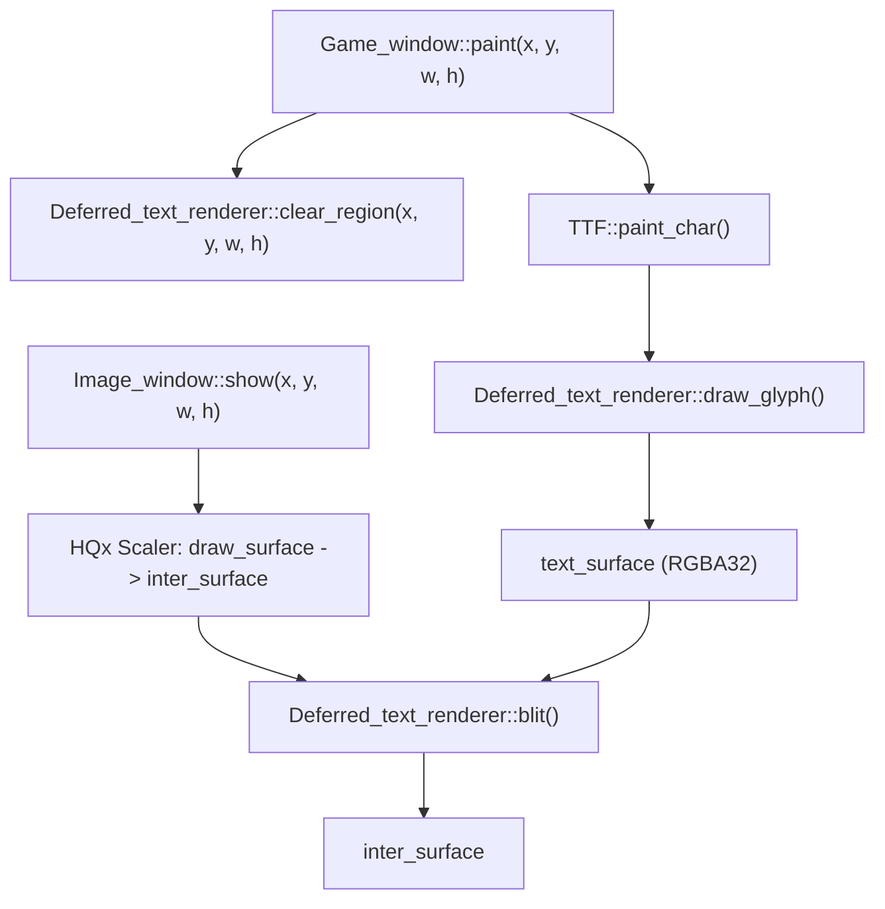

# Persistent High-Resolution Font Rendering Design Specification

## 1. Goal & Context
The goal is to fix CJK font rendering quality when using HQx scalers in Exult. 
HQx scalers distort thin pixel strokes of fonts. Bypassing the low-resolution 8-bit `draw_surface` and rendering fonts at post-scaled resolution on `inter_surface` avoids HQx artifacts.
However, because Exult updates the screen incrementally using dirty rectangles (especially during mouse movement or sprite animations), direct blits of the background from `draw_surface` to `inter_surface` overwrite and erase the high-resolution Chinese text.

This design introduces a persistent 32-bit RGBA surface (`text_surface`) that mirrors the size of `inter_surface`. Font rendering draws directly to `text_surface`. Active text persists across frames, and is selectively cleared only when the underlying game area is repainted.

## 2. Architecture & Components

### Component A: Image Buffer Getters
- Expose `offset_x` and `offset_y` from `Image_buffer` via public inline functions `get_offset_x()` and `get_offset_y()`.
- Expose `paletted_surface` and `inter_surface` from `Image_window` via public functions `get_paletted_surface()` and `get_inter_surface()`.

### Component B: Persistent Text Surface Manager (`Deferred_text_renderer`)
- Manages `SDL_Surface* text_surface` in `deferred_text.h` and `deferred_text.cc`.
- `set_active(enable, scale_factor, w, h)`: Creates `text_surface` of size `(w, h)` in `SDL_PIXELFORMAT_RGBA32` format and sets blend mode to `SDL_BLENDMODE_BLEND`. Frees the surface when disabled.
- `clear_region(x, y, w, h)`: Clears a scaled rectangle of `text_surface` corresponding to the repainted game coordinate region using `SDL_FillSurfaceRect()`.
- `clear()`: Clears the entire `text_surface` to fully transparent.
- `draw_glyph()`: Renders grayscale FreeType glyphs with subpixel alpha blending directly onto `text_surface` at scaled coordinates `((x + offset_x) * scale, (y + offset_y) * scale)`.
- `blit(inter_surface, x, y, w, h, guard_band)`: Copy-blits the dirty rect from `text_surface` onto `inter_surface` using `SDL_BlitSurface()`.

### Component C: Integration with Rendering Loops
- **Font Rendering (`ttf_font.cc::paint_char`)**: Intercepts CJK glyph drawing and redirects it to `Deferred_text_renderer::instance().draw_glyph()`.
- **Game Window Paint (`gamerend.cc::paint`)**: Calls `clear_region()` on `Deferred_text_renderer` immediately after clipping the guard band to prepare the `text_surface` dirty area.
- **Screen Clear (`gamewin.cc::clear_screen`)**: Calls `clear()` to wipe all persistent text.
- **Image Window Show (`imagewin.cc::show`)**: Calls `blit()` after the HQx scaling pass to composite the text back on top of the scaled dirty rect of `inter_surface`.

## 3. Verification Plan
- Verify that Chinese text displays clearly in windowed mode with HQ4x.
- Verify that mouse movements over Chinese text do not cause the characters to flicker, fade, or disappear.
- Verify that opening and closing gumps/containers clears the text correctly.
- Verify that NPC barks (floating barks) disappear correctly when they time out.
